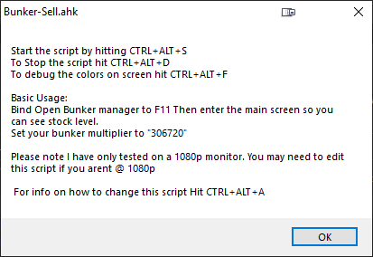

# bunker-ahk
AUTOHOTKEY SCRIPT FOR 2T1 MU BUNKER METHOD

### Step 1: 
Install AutoHotKey 1.1
https://www.autohotkey.com/

### Step 3: 
Follow this tutorial to get the multiplier and everything set up 
https://youtu.be/DHfVRy5KhWk

### Step 4: 
Launch AutoHotKey WindowSpy

### Step 5: 
Find the <b>"Sell Stock"</b> Box in the Bunker Manager app and take note of the Window Position 
This can be any RED Pixel. (505, 632 By Default) 

### Step 8: 
Edit the file to the correct pixel number in the AHK file via notepad
to get the current color hit <b>CTRL+ALT+F</b>

### Step 9: 
Start the script, Follow directions on screen.

https://youtu.be/ksP_EiwYq2s

#### FAQ: 

* my Script is not detecting the right color! How fix? Plz? <b>Run as windowed 1080p (1920x1080)</b>
