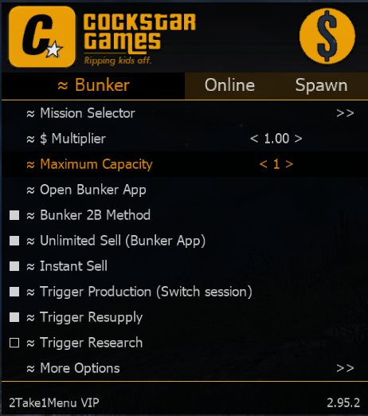
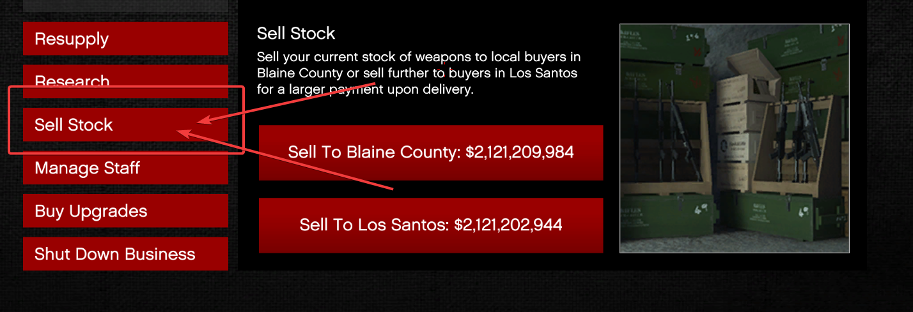

# bunker-ahk
AUTOHOTKEY SCRIPT FOR 2T1 MU BUNKER METHOD

### Step 1: 
Install AutoHotKey 1.1
https://www.autohotkey.com/

### Step 3: 
Enable The following Options

### Step 4: 
Launch AutoHotKey WindowSpy

### Step 5: 
Find the <b>"Sell Stock"</b> Box in the Bunker Manager app and take note of the Window Position 

<b>This can be any RED Pixel. (505, 632 By Default)</b> 

### Step 6: 
Edit the file to the correct pixel number in the AHK file via notepad

#### <b>to get the current color hit CTRL+ALT+F</b>

### Step 7: 
Start the script, Follow directions on screen.

#### FAQ: 

* my Script is not detecting the right color! How fix? Plz? <b>Run as windowed 1080p (1920x1080)</b>
