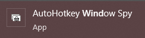

# bunker-ahk
AUTOHOTKEY SCRIPT FOR 2T1 MU BUNKER METHOD

### Step 1: 
Install AutoHotKey 1.1
https://www.autohotkey.com/

### Step 3: 
Follow this tutorial to get the multiplier and everything set up 
https://youtu.be/DHfVRy5KhWk

### Step 4: 
Launch AutoHotKey WindowSpy

### Step 5: 
Find the <b>"Stock Level"</b> Bar in the Bunker Manager app and make sure it is at 1/100

### Step 6: 
Find the <b>"Blue Pixel"</b> on the Stock Level and look at WindowSpy, take Note of the Window position 

> Window: 1395, 477

> Color:    F0F0F0 (Red=F0 Green=F0 Blue=F0)

### Step 7: 
Find the <b>"BLACK Pixel"</b> Just to the right of the Blue Pixel on the Stock Level and look at WindowSpy, take Note of the Window position 
This is important as it will stop the script if you have more then 1/100 stock

### Step 8: 
Edit the file to the correct pixel number in the AHK file via notepad
to get the current color hit <b>CTRL+ALT+F</b>

### Step 9: 
Start the script, Follow directions on screen.
